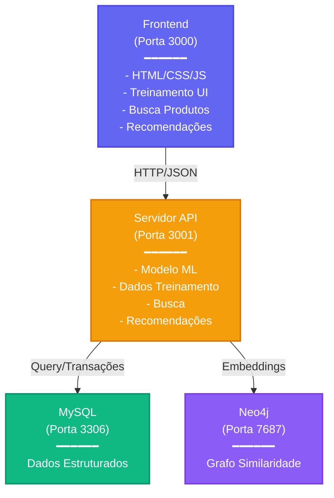

# Sistema de Recomendação de E-Commerce com Machine Learning

Um sistema completo de recomendação de produtos alimentado por TensorFlow.js, com recursos de recomendações inteligentes usando redes neurais e busca de similaridade em grafo. Desenvolvido como uma melhoria de um template de pós-graduação da UniPDS, este projeto demonstra integração avançada de ML com tecnologias web modernas.

## Índice

- [Visão Geral do Projeto](#visão-geral-do-projeto)
- [Stack Tecnológico](#stack)
- [Arquitetura](#arquitetura)
- [Estrutura do Projeto](#estrutura-do-projeto)
- [Começando](#começando)
- [Setup de Dados](#setup-de-dados)
- [Uso](#uso)
- [Treinamento do Modelo](#treinamento-do-modelo)
- [Pipeline de Recomendação](#pipeline-de-recomendação)
- [Endpoints da API](#endpoints-da-api)

---

## Visão Geral do Projeto

Este projeto combina múltiplas tecnologias para criar um mecanismo de recomendação inteligente:

- **Machine Learning**: Rede neural TensorFlow.js para scoring de recomendação de produtos
- **Banco de Dados em Grafo**: Neo4j para busca rápida de similaridade usando distância cosseno entre embeddings
- **Banco de Dados Relacional**: MySQL para armazenar usuários, produtos, categorias, marcas e histórico de compras
- **Frontend**: HTML/CSS moderno (Tailwind) com JavaScript vanilla
- **API Backend**: Servidor HTTP Node.js manipulando processamento de dados e gerenciamento de modelos

O sistema funciona analisando padrões de compra de usuários e atributos de produtos, depois aproveitando tanto a similaridade baseada em grafo quanto as predições da rede neural para gerar recomendações de produtos personalizadas.

---

## Stack Tecnológico

### Serviços (Docker)

| Serviço | Imagem           | Porta(s)       | Descrição                           |
|---------|------------------|----------------|-------------------------------------|
| `app`   | Dockerfile       | `3000`         | Frontend com browser-sync hot reload|
| `api`   | Dockerfile       | `3001`         | API Node.js + driver Neo4j          |
| `mysql` | mysql:8.0        | `3306`         | Banco relacional (schema + dados)   |
| `neo4j` | neo4j:2026.01.4  | `7474`, `7687` | Banco em grafo para embeddings      |

### Bibliotecas e Ferramentas

- **TensorFlow.js**: Treinamento e inferência de redes neurais
- **Tailwind CSS**: Framework CSS utility-first
- **Browser-sync**: Servidor de desenvolvimento com hot reload
- **mysql2**: Cliente MySQL para Node.js
- **neo4j-driver**: Driver oficial Neo4j
- **Web Workers**: Thread de background para treinamento de modelo
- **Concurrently**: Executador de múltiplos scripts npm simultaneamente

---

## Arquitetura



---

## Estrutura do Projeto

### Organização do Código-Fonte

O diretório **`src/`** contém toda a lógica de aplicação organizada por padrão MVC:

**Controllers** (em `src/controller/`): Orquestram o padrão MVC
- ModelTrainingController.js: Gerencia o fluxo de treinamento
- ProductController.js: Manipula busca e exibição de produtos
- UserController.js: Gerencia seleção e exibição de perfil de usuário
- EventLogController.js: Controla a UI do log de eventos
- TFVisorController.js: Gerencia visualização de modelo
- WorkerController.js: Comunica com Web Worker de background

**Views** (em `src/view/`): Renderizam componentes de UI
- ModelTrainingView.js: Interface de treinamento e gráficos de métricas
- ProductView.js: Exibição de lista e resultados de busca de produtos
- UserView.js: Dropdown de seleção e exibição de perfil de usuário
- EventLogView.js: Exibição de log de eventos em tempo real
- TFVisorView.js: Visualização TensorFlow.js Visor
- View.js: Classe base com lógica comum de renderização

**Services Frontend** (em `src/service/`): Gerenciam lógica de negócio frontend
- UserService.js: Busca, cache e gerenciamento de dados de usuário
- ProductService.js: Busca, cache e gerenciamento de dados de produto

**Services Backend** (em `src/services/`): Manipulam operações do lado da API
- mysqlService.js: Pool de conexão MySQL e execução de consultas
- neo4jService.js: Conexão Neo4j e consultas de busca de similaridade

**Sistema de Eventos** (em `src/events/`): Comunicação entre componentes
- events.js: Emissor de eventos global
- constants.js: Constantes de tipos de eventos

**Web Workers** (em `src/workers/`): Execução em thread de background
- modelTrainingWorker.js: Executa treinamento de modelo em background (evita bloqueio de UI)

**Pontos de Entrada Frontend**
- index.js: Ponto de entrada frontend (inicializa controllers e services)
- server.js: Servidor API backend (rotas HTTP e manipuladores)
- input.css: Arquivo de entrada CSS Tailwind (compilado para style.css)

### Diretório de Armazenamento de Modelo Treinado

O diretório **`model/`** armazena modelos treinados persistidos:

- **model.json**: Contém arquitetura do modelo (topologia) e manifesto de pesos
- **weights.bin**: Arquivo binário contendo todos os pesos treinados

### Diretório de Dados

O diretório **`data/`** contém:

- **migration.sql**: Schema MySQL e setup inicial (auto-executa quando o container inicia)
- **import_scripts/**: Scripts Node.js para importar dados CSV para MySQL:
  - 01_import_users.js: Importa dados de usuários do CSV
  - 02_import_categories.js: Importa categorias de produtos
  - 03_import_brands.js: Extrai e importa marcas
  - 04_import_products.js: Importa produtos com referências categoria/marca
  - 05_import_orders.js: Importa histórico de compras
  - clear_table.js: Utilitário para limpar tabelas específicas
  - clear_all.js: Utilitário para limpar todos os dados

### Arquivos Raiz

- **index.html**: HTML de aplicação de página única
- **style.css**: CSS Tailwind compilado (gerado a partir de input.css)
- **package.json**: Dependências npm e scripts
- **Dockerfile**: Definição de imagem de container
- **docker-compose.yml**: Orquestração de múltiplos containers
- **.env**: Variáveis de ambiente (credenciais Neo4j, senha MySQL)
- **README.md**: Documentação do projeto (versão em inglês)
- **README-pt-br.md**: Documentação do projeto (versão em português)

### Papéis de Diretórios-Chave

- **`src/controller/` + `src/view/`**: Padrão MVC frontend para separação de lógica de UI
- **`src/service/` (frontend) vs `src/services/` (backend)**: Camadas de lógica de negócio
- **`src/workers/`**: Web Worker executa treinamento de modelo em thread de background
- **`src/events/`**: Sistema de evento centralizado para comunicação entre componentes
- **`model/`**: Modelo treinado persistido (sobrevive ao reload de página, auto-criado após treinamento)

---

## Começando

### Pré-requisitos

- Docker & Docker Compose instalados
- Um arquivo CSV com dados de produto/pedido (ex: `.tmp/csv/kz.csv`). Link para baixar no kaggle: https://www.kaggle.com/datasets/mkechinov/ecommerce-purchase-history-from-electronics-store
- Variáveis de ambiente configuradas em `.env`

### Início Rápido

1. **Navegue para o Diretório do Projeto**
   ```bash
   cd projeto-01-atividade
   ```

2. **Configure as Variáveis de Ambiente**
   ```bash
   # Crie arquivo .env
   cat > .env << EOF
   NEO4J_USERNAME=neo4j
   NEO4J_PASSWORD=sua_senha_aqui
   MYSQL_ROOT_PASSWORD=root
   EOF
   ```

3. **Inicie Todos os Serviços**
   ```bash
   docker-compose up
   ```
   - Frontend: http://localhost:3000
   - API: http://localhost:3001
   - MySQL: localhost:3306
   - Neo4j Browser: http://localhost:7474

4. **Verifique os Serviços**
   ```bash
   curl http://localhost:3001/health
   ```
   Resposta esperada: `{"status":"ok","neo4j":"connected"}`

---

## Setup de Dados

### Importando Dados CSV para MySQL

O projeto inclui scripts Node.js automatizados para importar dados CSV para MySQL.

#### Passo 1: Acesse o Container da Aplicação

```bash
# Entre no container da aplicação em execução
docker exec -it <nome-do-container-app> bash

# Navegue para o diretório de scripts de importação
cd /app/data/import_scripts

# Instale dependências Node.js
npm install
```

#### Passo 2: Execute os Scripts de Importação em Ordem

**Importante**: Os scripts devem executar em ordem devido a restrições de chave estrangeira:

```bash
# Importar usuários
MYSQL_HOST=mysql node 01_import_users.js

# Importar categorias
MYSQL_HOST=mysql node 02_import_categories.js

# Importar marcas
MYSQL_HOST=mysql node 03_import_brands.js

# Importar produtos (depende de marcas e categorias)
MYSQL_HOST=mysql node 04_import_products.js

# Importar pedidos (depende de usuários e produtos)
MYSQL_HOST=mysql node 05_import_orders.js
```

**O que cada script importa:**

| Script | Origem | Destino | Observações |
|--------|--------|---------|------------|
| 01_import_users.js | CSV: user_id | tabela users | Auto-gera nomes mock & distribuição de idade |
| 02_import_categories.js | CSV: category_id | tabela categories | Cria entradas de categoria |
| 03_import_brands.js | CSV: brand | tabela brands | Extrai marcas únicas de produtos |
| 04_import_products.js | CSV: product_id | tabela products | Vincula a categorias e marcas via FK |
| 05_import_orders.js | CSV: order_id | tabela orders | Vincula compras de usuário e produto |

#### Passo 3: Opcional - Limpeza Manual de Dados para Treinamento Mais Rápido

A importação CSV pode resultar em um dataset grande (1000+ produtos, 1000+ pedidos). Para acelerar o treinamento de modelo durante desenvolvimento, reduza manualmente a contagem de registros:

```bash
# Dentro do shell do container, conecte ao MySQL
mysql -h mysql -u root -proot -D projeto_01

-- Reduza para 200 produtos mais recentes
DELETE FROM products WHERE id NOT IN (
  SELECT id FROM products ORDER BY id DESC LIMIT 200
);

-- Reduza para 500 pedidos mais recentes
DELETE FROM orders WHERE id NOT IN (
  SELECT id FROM orders ORDER BY id DESC LIMIT 500
);

-- Saia do MySQL
exit;
```

> **Dica Pro**: Menos registros de treinamento = iterações de treinamento mais rápidas. Recomendado para experimentação:
> - 100-300 produtos
> - 200-500 pedidos
> - Isso fornece diversidade suficiente enquanto mantém o treinamento em menos de 10 segundos

---

## Uso

### Recursos da Aplicação Frontend

A interface web oferece um ambiente interativo para treinamento de modelo e recomendações de produtos.

#### 1. Seleção de Usuário

- **Menu Suspenso**: Selecione qualquer usuário do banco de dados
- **Exibição de Perfil**: Mostra idade do usuário selecionado e histórico completo de compras
- **Atualização de Contexto**: Recomendações são personalizadas para o usuário selecionado

#### 2. Busca e Filtros de Produtos

- **Barra de Busca**: Encontre produtos pelo nome (busca full-text)
- **Filtro de Categoria**: Filtre por categoria de produto (dropdown estilizado com Tailwind)
- **Filtro de Marca**: Filtre por marca de produto (UI melhorada versus template original)
- **Exibição de Resultados**: Mostra nome, preço, categoria e marca do produto

#### 3. Treinamento de Modelo

- **Botão Train**: Inicia o treinamento da rede neural
- **Gráficos em Tempo Real**: Acurácia e perda visualizadas via TensorFlow.js Visor
- **Logs Verbosos**: Log de eventos mostra cada passo de treinamento com timestamps
- **Auto-save**: Modelo salva automaticamente no diretório `model/` após treinamento
- **Sem Retreinamento**: No reload de página, modelo salvo é carregado do disco

#### 4. Obter Recomendações

- **Botão Recommend**: Gera recomendações de produtos personalizadas
- **Pipeline de Dois Estágios**:
  1. Neo4j encontra 10 produtos mais similares (similaridade cosseno)
  2. Rede neural os ordena por score de recomendação
- **Resultados**: Top 10 produtos ordenados de 1-10 com scores de similaridade

### Responsabilidades de Arquivos

**Frontend - Controllers** (em `src/controller/`):
- UserController.js: Gerencia seleção de usuário e exibição de perfil
- ProductController.js: Manipula busca, filtros e exibição de produtos
- ModelTrainingController.js: Orquestra o processo de treinamento
- TFVisorController.js: Gerencia exibição de visualização de modelo
- EventLogController.js: Exibe eventos de treinamento em tempo real
- WorkerController.js: Comunica com Web Worker

**Frontend - Services** (em `src/service/`):
- UserService.js: Busca e cache de dados de usuário da API
- ProductService.js: Busca e cache de dados de produto da API

**Backend - Server** (em `src/server.js`):
- Servidor HTTP escutando na porta 3001
- Roteia requisições HTTP para manipuladores apropriados
- Agrega dados de MySQL e Neo4j
- Gerencia persistência de modelo (salvar/carregar no disco)
- Computa recomendações

**Backend - Services** (em `src/services/`):
- mysqlService.js: Pool de conexão MySQL e execução de consultas
- neo4jService.js: Conexão Neo4j e busca de similaridade

---

## Treinamento do Modelo

### Visão Geral do Processo de Treinamento

O pipeline de treinamento de modelo segue um fluxo de machine learning padrão:

1. **Preparação de Dados e Normalização**
   - Idade do usuário: Escalada Min-max para [0, 1]
   - Preço do produto: Escalada Min-max para [0, 1]
   - Categorias: One-hot encoded (ex: Eletrônicos=[1,0,0,...])
   - Marcas: One-hot encoded
   - Resultado: Matriz de features onde cada linha representa um par (usuário, produto)

2. **Divisão Train/Test**
   - 80% dos dados para treinamento
   - 20% dos dados para validação
   - Dados originários do endpoint MySQL `/api/training-data`
   - Features + labels criados a partir de pedidos de produtos

3. **Arquitetura de Rede Neural**
   
   **Estratégia Atual: 8-4-1 (ReLU-ReLU-Sigmoid)**
   
   ```
   Camada de Entrada (8 features)
           ↓
   Dense 4 neurônios + ativação ReLU
           ↓
   Dense 1 neurônio + ativação Sigmoid
           ↓
   Saída (score de predição 0-1)
   ```

4. **Configuração de Treinamento**
   - **Optimizer**: Adam (taxa de aprendizado adaptativa)
   - **Função de Perda**: Binary crossentropy (classificação)
   - **Épocas**: Configurável (padrão ~50)
   - **Batch Size**: Configurável
   - **Métricas**: Acurácia e perda rastreadas por época

### Persistência de Modelo

Após treinamento completar, o modelo salva automaticamente no diretório `model/`:

O diretório contém dois arquivos:
- **model.json**: Contém a topologia do modelo (definições de camada) e manifesto de pesos (referência para weights.bin)
- **weights.bin**: Arquivo binário contendo todos os pesos treinados

**No reload de página**: Se o diretório `model/` existe, o modelo treinado é automaticamente carregado do disco ao invés de exigir retreinamento.

### Conceitos Avançados de Treinamento

#### Pipeline de Feature Engineering

O sistema de treinamento normaliza e codifica:

**Features Numéricas** (Escalagem Min-max para [0, 1]):
- Idade do usuário (20-80 anos → 0-1)
- Preço do produto (típicamente 10-1000 unidades → 0-1)

**Features Categóricas** (One-hot encoding):
- Categoria de produto (ex: "Eletrônicos" → [1, 0, 0, ...])
- Marca de produto (ex: "Samsung" → [0, 1, 0, ...])

**Features Agregadas** (Derivadas de dados):
- Idade média do usuário por produto (do histórico de pedidos)
- Popularidade do produto (número de pedidos)

#### Visualização de Época e Perda

O TensorFlow.js Visor em tempo real exibe:
- **Acurácia**: Percentual de predições corretas (0-100%)
- **Perda**: Erro de binary crossentropy
- **Atualizada**: Cada época mostra progresso
- **Propósito**: Detectar overfitting (perda treinamento ↓ mas perda teste ↑) ou underfitting

---

## Pipeline de Recomendação

O sistema de recomendação usa uma abordagem de dois estágios combinando similaridade de grafo e predições de rede neural:

### Estágio 1: Busca de Similaridade Baseada em Grafo (Neo4j)

1. **Criar Vetor de Usuário**: Rede neural codifica perfil de usuário em representação vetorial
2. **Busca de Similaridade Cosseno**: Encontrar 10 produtos em Neo4j com maior similaridade cosseno ao vetor de usuário
3. **Proximidade Semântica**: Retorna produtos semanticamente similares às preferências do usuário

```javascript
const userVector = [0.5, 0.3, 0.8, 0.2, ...];  // Vetor 8D
const similarProducts = await Neo4jService.findSimilarProducts(userVector, 10);
```

### Estágio 2: Predição da Rede Neural (TensorFlow.js)

1. **Refinamento de Score**: Aplicar modelo treinado a cada um dos 10 produtos similares
2. **Ordenação de Confiança**: Gerar score de predição (0-1) para cada produto
3. **Ordenação Final**: Ordenar produtos por score de predição, retornar ordenação de 1-10

---

## Endpoints da API

### Gerenciamento de Modelo

| Método | Endpoint | Descrição |
|--------|----------|-----------|
| GET | `/api/model/exists` | Verifica se modelo treinado existe |
| POST | `/api/model/save` | Salva modelo treinado (topologia + pesos) |
| GET | `/model/:arquivo` | Serve model.json ou weights.bin |

### Dados de Treinamento

| Método | Endpoint | Descrição |
|--------|----------|-----------|
| GET | `/api/training-data` | Obtém produtos, pedidos, usuários, categorias, marcas + stats de normalização |

### Gerenciamento de Usuário

| Método | Endpoint | Descrição |
|--------|----------|-----------|
| GET | `/api/users` | Lista todos os usuários (limite 100) |
| GET | `/api/users/search?q=:query` | Busca usuários por nome |
| GET | `/api/user-purchases/:userId` | Obtém histórico de compras do usuário |
| POST | `/api/user-purchases` | Adiciona nova compra (pedido) |
| DELETE | `/api/user-purchases/:userId/:productId` | Remove compra |

### Gerenciamento de Produto

| Método | Endpoint | Descrição |
|--------|----------|-----------|
| GET | `/api/products/search?q=:query&category=:id&brand=:id` | Busca produtos com filtros |
| GET | `/api/categories` | Lista todas as categorias de produto |
| GET | `/api/brands` | Lista todas as marcas de produto |
| POST | `/api/products/save-vectors` | Salva embeddings de produto no Neo4j |

### Recomendações

| Método | Endpoint | Descrição |
|--------|----------|-----------|
| POST | `/api/products/similar` | Encontra produtos similares (Neo4j cosseno) |

### Saúde

| Método | Endpoint | Descrição |
|--------|----------|-----------|
| GET | `/health` | Verificação de saúde da API (conectividade Neo4j) |

---

## Melhorias do Template Original

Este projeto estende o template original da pós-graduação UniPDS com:

1. **Containerização**: Setup completo de Docker/Docker Compose
2. **Integração de Banco de Dados**: MySQL para dados estruturados, Neo4j para embeddings
3. **API Externa**: Servidor HTTP Node.js isolado para independência de serviço
4. **Busca Melhorada**: Busca robusta de produtos com filtros de categoria e marca
5. **Filtragem por Marca**: Trocado de cor de produto para atributo de marca
6. **Logs Verbosos**: Logs detalhados passo-a-passo de treinamento de eventos
7. **Persistência de Modelo**: Modelos treinados salvos localmente; reutilizados no reload de página
8. **Estilos Modernos**: Tailwind CSS para design responsivo utility-first
9. **Visualização em Tempo Real**: Integração TensorFlow.js Visor para métricas de treinamento
10. **Recomendações Avançadas**: Pipeline de dois estágios (similaridade de grafo + predição NN)


---

## Contribuindo

Este projeto é parte de um programa de pós-graduação em Engenharia com IA Aplicada. Contribuições bem-vindas via pull requests.

---
